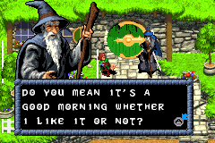

A title that no one expected and no one was waiting for (except maybe for Tolkien fans). It's an action game with puzzle elements presented in an isometric view. It was released in 2003, along with versions for GameCube, PS2, Xbox and PC. The authors said it was inspired by The Legend of Zelda. For me, it's aimed more at children. I found it a bit simple and short. I finished it in about four hours. The graphics are fine, some of it looks like renders from the GameCube version rather than hand drawn. The story follows the book, so we meet all the main characters, including Beorn and Bard. We can use Sting to fight and also use the Ring, which is a necessity in some locations.

